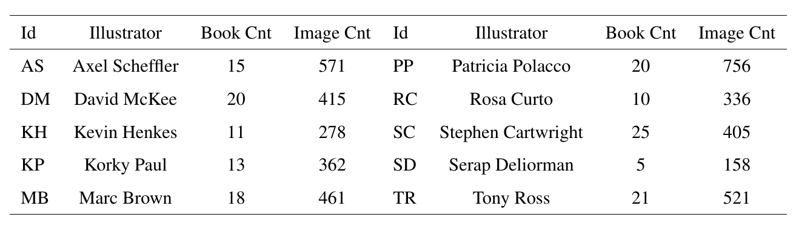
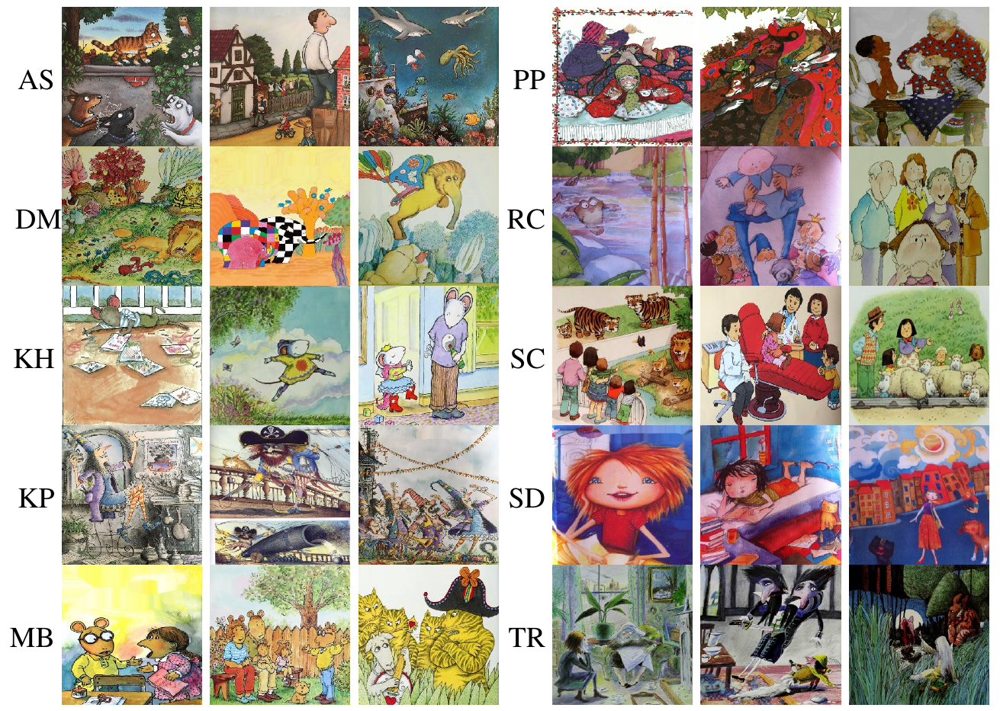
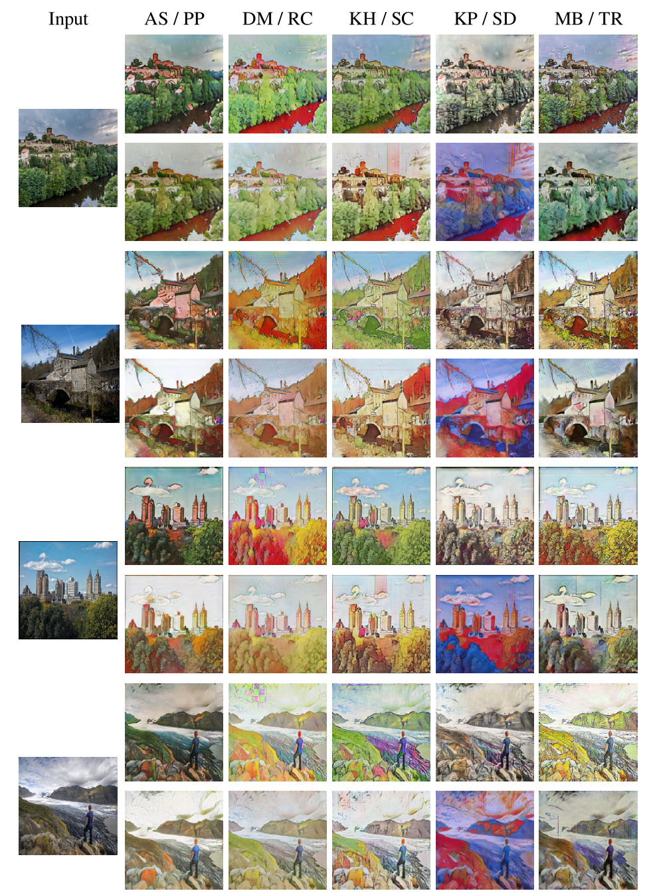
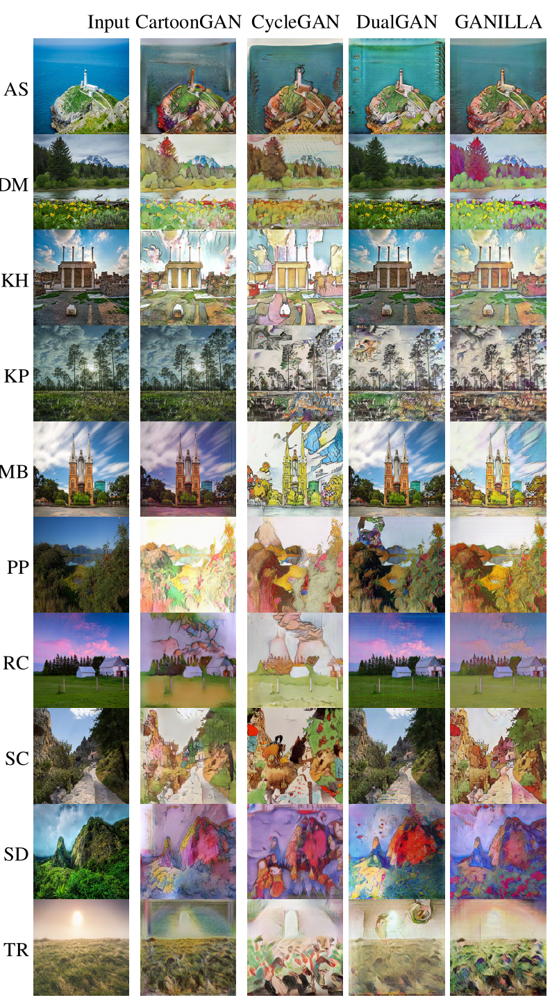
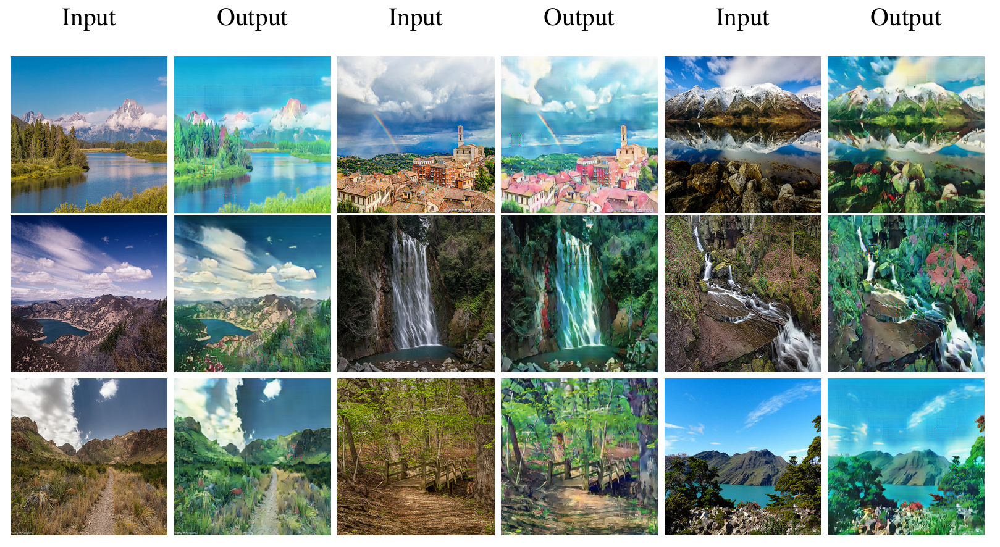
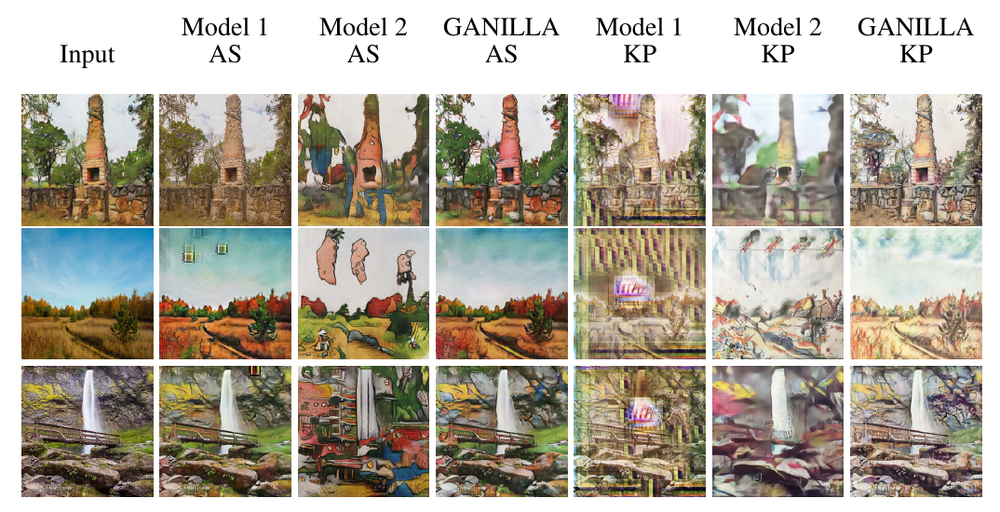

# GANILLA

We provide PyTorch implementation for: 

GANILLA: Generative Adversarial Networks for Image to Illustration Translation.

[Paper](https://www.sciencedirect.com/science/article/pii/S0262885620300184)
[Arxiv](https://arxiv.org/abs/2002.05638)


**Dataset Stats:**



**Sample Images:**




**GANILLA**:


**GANILLA results on the illustration dataset:**



**Comparison with other methods:**



**Style transfer using Miyazaki's anime images:**



**Ablation Experiments:**



## Prerequisites
- Linux, macOS or Windows
- Python 2 or 3
- CPU or NVIDIA GPU + CUDA CuDNN

## Getting Started
### Downloading Datasets
Please refer to [datasets.md](docs/datasets.md) for details.

### Installation

- Clone this repo:
```bash
git clone https://github.com/giddyyupp/ganilla.git
cd ganilla
```

- Install PyTorch 0.4+ and torchvision from http://pytorch.org and other dependencies (e.g., [visdom](https://github.com/facebookresearch/visdom) and [dominate](https://github.com/Knio/dominate)). You can install all the dependencies by
```bash
pip install -r requirements.txt
```

- For Conda users, we include a script `./scripts/conda_deps.sh` to install PyTorch and other libraries.

### GANILLA train/test
- Download a GANILLA/CycleGAN dataset (e.g. maps):

```bash
bash ./datasets/download_cyclegan_dataset.sh maps
```
- Train a model:
```bash
#!./scripts/train_ganilla.sh
python train.py --dataroot ./datasets/maps --name maps_cyclegan --model cycle_gan --netG resnet_fpn
```
- To view training results and loss plots, run `python -m visdom.server` and click the URL http://localhost:8097. To see more intermediate results, check out `./checkpoints/maps_cyclegan/web/index.html`
- Test the model:
```bash
#!./scripts/test_cyclegan.sh
python test.py --dataroot ./datasets/maps --name maps_cyclegan --model cycle_gan --netG resnet_fpn
```
The test results will be saved to a html file here: `./results/maps_cyclegan/latest_test/index.html`.

You can find more scripts at `scripts` directory.

### Apply a pre-trained model (GANILLA)
- You can download pretrained models using following [link](https://drive.google.com/drive/folders/1HT9JxGMk7L94OmIeV5fqrPBy-bVn1u9L?usp=sharing)

Put a pretrained model under `./checkpoints/{name}_pretrained/100_net_G.pth`.

- To test the model, you also need to download the  monet2photo dataset and use trainB images as source:

```bash
bash ./datasets/download_cyclegan_dataset.sh monet2photo
```

- Then generate the results using
```bash
python test.py --dataroot datasets/monet2photo/testB --name {name}_pretrained --model test
```
The option `--model test` is used for generating results of GANILLA only for one side. `python test.py --model cycle_gan` will require loading and generating results in both directions, which is sometimes unnecessary. The results will be saved at `./results/`. Use `--results_dir {directory_path_to_save_result}` to specify the results directory.

- If you would like to apply a pre-trained model to a collection of input images (rather than image pairs), please use `--dataset_mode single` and `--model test` options. Here is a script to apply a model to Facade label maps (stored in the directory `facades/testB`).

``` bash
#!./scripts/test_single.sh
python test.py --dataroot ./datasets/monet2photo/testB/ --name {your_trained_model_name} --model test
```
You might want to specify `--netG` to match the generator architecture of the trained model.


## [Training/Test Tips](docs/tips.md)
Best practice for training and testing your models.

## [Frequently Asked Questions](docs/qa.md)
Before you post a new question, please first look at the above Q & A and existing GitHub issues.


## Citation
If you use this code for your research, please cite our papers.
```
@article{hicsonmez2020ganilla,
  title={GANILLA: Generative adversarial networks for image to illustration translation},
  author={Hicsonmez, Samet and Samet, Nermin and Akbas, Emre and Duygulu, Pinar},
  journal={Image and Vision Computing},
  pages={103886},
  year={2020},
  publisher={Elsevier}
}

@inproceedings{Hicsonmez:2017:DDN:3078971.3078982,
 author = {Hicsonmez, Samet and Samet, Nermin and Sener, Fadime and Duygulu, Pinar},
 title = {DRAW: Deep Networks for Recognizing Styles of Artists Who Illustrate Children's Books},
 booktitle = {Proceedings of the 2017 ACM on International Conference on Multimedia Retrieval},
 year = {2017}
}
```
## Acknowledgments
Our code is heavily inspired by [CycleGAN](https://github.com/junyanz/pytorch-CycleGAN-and-pix2pix).

The numerical calculations reported in this work were fully performed at TUBITAK ULAKBIM, High Performance and Grid Computing Center (TRUBA resources).